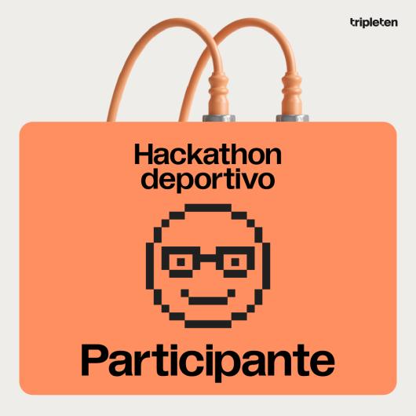

# Análisis Estadístico FIFA: Hackathon Deportivo TripleTen

## Introducción

Bienvenidos a nuestro proyecto para el Hackathon Deportivo de TripleTen. Aquí hemos construido una solución que combina la ciencia de datos y el desarrollo web para analizar y presentar estadísticas sobre la FIFA desde 1993 hasta la fecha. Nuestro enfoque principal es no solo presentar datos, sino hacerlo de manera interactiva y visualmente atractiva para todos los usuarios.

## Descripción

El Hackathon Deportivo es una competencia amistosa donde el desafío principal es analizar y presentar datos de forma accesible. Gracias al equipo multidisciplinario de Data Science y Desarrollo Web, logramos sumergirnos en el conjunto de datos, extraer hallazgos significativos y, finalmente, plasmarlos en un sitio web visualmente impactante.

Nuestro análisis principal se centra en la historia de la FIFA y los equipos que la componen. Además, desarrollamos un modelo predictivo que busca superar las predicciones basadas únicamente en el ranking FIFA.

## Tecnologías Utilizadas

**Front-end**:

- JavaScript
- CSS
- HTML
- React

**Back-end**:

- Python (Google Colab con formato .ipynb para análisis de datos)

## Estructura del Proyecto

**Raíz**:

- `package-lock.json`: Dependencias del proyecto.
- `package.json`: Configuraciones y scripts del proyecto.
- `index.html`: Punto de entrada al sitio.
- `favicon.ico`, `logo192.png`, `logo512.png`: Íconos y logos del sitio.
- `manifest.json`: Configuraciones del sitio web.
- `robots.txt`: Directrices para robots de motores de búsqueda.
- `App.js`: Componente principal de React.
- `App.test.js`: Test para el componente principal.
- `index.css`: Estilos globales.
- `index.js`: Punto de entrada principal de JavaScript.
- `reportWebVitals.js`, `setupTests.js`: Configuraciones y utilidades.

**Directorios**:

- `blocks`: Componentes y lógica relacionada.
- `components`: Componentes de React reutilizables.
- `fonts`: Fuentes utilizadas en el sitio.
- `image`: Imágenes y activos gráficos.
- `vendor`: Librerías y dependencias de terceros.

## Expectativas

Con este proyecto, esperamos brindar a los aficionados del fútbol y a los entusiastas de la ciencia de datos una herramienta que les permita entender mejor las tendencias y patrones en el mundo del fútbol. También aspiramos a que esta solución sea un punto de referencia para futuros análisis y desarrollos en el ámbito deportivo.

## Agradecimientos

Extendemos nuestro agradecimiento al equipo de TripleTen por organizar este Hackathon y desafiarnos a poner en práctica nuestras habilidades. Esta experiencia nos ha permitido crecer y aplicar lo aprendido durante nuestro bootcamp.

## Equipo: WebData Warriors

| Diciplina      | Nombre                                            | País      |
| :------------- | :------------------------------------------------ | :-------- |
| Web Developer  | [Isabel Martinez](https://github.com/SoyIsabelMM) | Chile     |
| Web Developer  | [Matias Campos](https://github.com/2022matias)    | Argentina |
| Data Scientist | [Irene Reynoso](https://github.com/IreneRA)       | México    |
| Data Scientist | [Juan Felipe Nájera]()                            | Ecuador   |

## Sección de análisis de datos

| Elemento                                                                                                                                      | Descripción                                                                                                                                                                  |
| :-------------------------------------------------------------------------------------------------------------------------------------------- | :--------------------------------------------------------------------------------------------------------------------------------------------------------------------------- |
| [Datos crudos](https://github.com/IreneRA/Hackaton-Tripleten/tree/Raw-data)                                                                   | Datos obtenidos directamente de las fuentes de datos, sin haber sido procesados, limpiados o transformados.                                                                  |
| [Ventaja del equipo local](https://github.com/IreneRA/Hackaton-Tripleten/blob/team-advantage/Ventaja_del_equipo_local.ipynb)                  | Investigar la existencia y magnitud de la ventaja que puede tener un equipo al jugar en su propio país o continente y cómo esta ventaja se manifiesta en diferentes torneos. |
| [Influencia del portero en rondas de penaltis](https://github.com/IreneRA/Hackaton-Tripleten/blob/goalkeeper-impact/Influencia_portero.ipynb) | Estudiar la contribución y efectividad de los porteros durante las rondas de penaltis y determinar cuánto impactan en el resultado final de dichas rondas.                   |
| [Modelo predictivo](https://github.com/IreneRA/Hackaton-Tripleten/blob/predictive-model/Modelo_predictivo.ipynb)                              | Creación de un modelo que predice el resultado de un partido y comparación con las predicciones basadas en el ranking FIFA.                                                  |

## BADGES de la Hackathon

**Insignia por participación**

**Insignia como proyecto ganador de la Hackaton**

Nuestro equipo **WebData Warriors** salio como ganador del Hackathon Deportivo 🤖

La competencia fue intensa y todos hemos demostrado nuestro compromiso, creatividad y habilidades. Es inspirador ver cómo la pasión por el desarrollo y la innovación nos impulsa a alcanzar resultados sobresalientes.

Aquí te dejo el enlace a nuestra página web para que le des un vistazo --> [Enlace a la página web](https://soyisabelmm.github.io/Hackathon-Deportivo-WebData-Warriors/)
